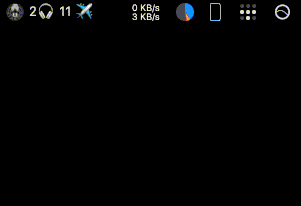

metroline
===========

A simple app to display a summary of what's going on in [https://nyartcc.org](ZNY) on VATSIM on Mac computers.

Installation:

1. Install [xbar](https://xbarapp.com).
2. Download the latest [release](https://github.com/mmp/metroline/releases).
3. Copy the `metroline.1m.cgo` executable to your `~/Library/Application Support/xbar/plugins` folder.
4. Launch `xbar` and select "refresh" in the `xbar` menu (on the right side of your menu bar).

